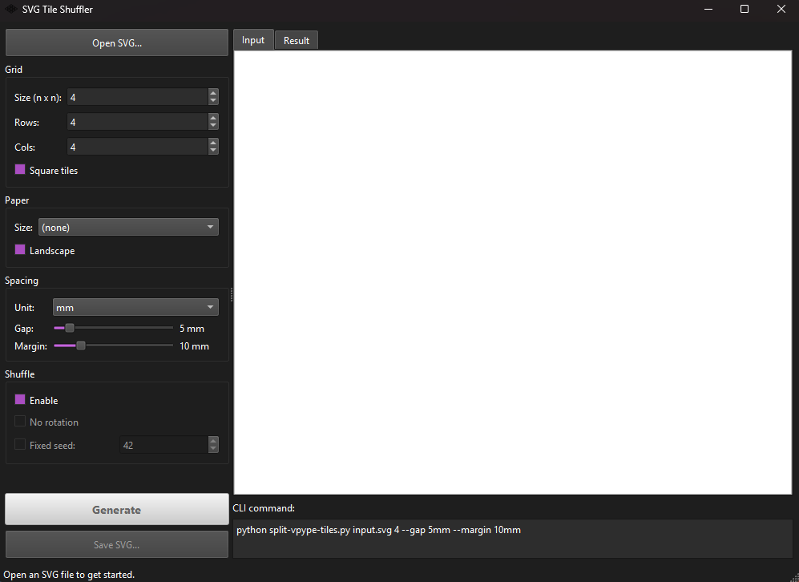

# SVG Tiles Shuffler

Split any SVG into a grid of tiles and reassemble them into a mosaic -- ordered or shuffled. Designed for **pen plotters** and generative art workflows.

 

## What it does

```
+----------+      +--+--+--+       +--+--+--+
|          |      |1 |2 |3 |       |5 |1 |6 |
|  INPUT   | ---> +--+--+--+ ----> +--+--+--+
|   SVG    | split|4 |5 |6 |shuffle|3 |2 |4 |
|          |      +--+--+--+       +--+--+--+
|          |      |7 |8 |9 |       |8 |9 |7 |
+----------+      +--+--+--+       +--+--+--+
                   3x3 grid        shuffled + rotated
```

1. **Split** -- crops the SVG into an NxM grid of tiles
2. **Shuffle** *(optional)* -- randomizes tile positions with rotation
3. **Reassemble** -- builds the final mosaic SVG, ready for plotting

### Key features

- **Square or rectangular grids** -- `4` for 4x4, or `--rows 3 --cols 5` for 3x5
- **Paper-aware layout** -- output directly to A6, A5, A4, A3, letter, or custom sizes
- **Exact dimensions** -- gap and margin are computed to be physically exact on the output page
- **Smart rotation** -- 90 deg increments for square tiles, 180 deg only for rectangular (no distortion)
- **Reproducible** -- use `--seed` for deterministic shuffles
- **Pen-plotter optimized** -- output is line-merged and sorted for efficient plotting

---

## Installation

### Quick start (recommended)

The easiest way to get started — one command that creates a virtual environment, installs all dependencies, and launches the desktop app:

```bash
git clone https://github.com/apollinariya06/svg-tiles-shuffler.git
cd svg-tiles-shuffler
python install_and_run.py
```

On subsequent runs, it skips the install and launches directly. To force a reinstall:

```bash
python install_and_run.py --install
```

> **Requires Python 3.10+** — check with `python --version`.

### Manual installation

If you prefer to manage your own environment:

```bash
python -m venv venv

# Windows
venv\Scripts\activate

# macOS / Linux
source venv/bin/activate

pip install -r requirements.txt
```

#### Dependencies

| Package | Purpose |
|---|---|
| [vpype](https://github.com/abey79/vpype) | SVG processing engine (split, crop, layout, merge) |
| [PySide6](https://doc.qt.io/qtforpython-6/) | Desktop UI (only needed for the graphical app) |

---

## How to use

Two ways to use the tool:

### Option 1: Desktop app (PySide6 UI)

The graphical interface — no command line needed.

```bash
# Via the launcher (handles venv automatically)
python install_and_run.py

# Or directly (with venv activated)
python UI_app.py
```

**Features:**
- **Drag & drop** SVG files onto the window
- **All options** accessible via sliders, dropdowns, and checkboxes
- **Native file dialogs** for Open and Save As
- **Live CLI preview** — see the equivalent command update as you change settings




### Option 2: Command line (CLI)

For scripting, automation, or if you prefer the terminal:

```bash
# With venv activated
python svg-tiles-shuffler.py drawing.svg 4 --paper a4 --shuffle --seed 42
```

See [CLI Reference](#cli-reference) below for all options.

---

## CLI Reference

```
python svg-tiles-shuffler.py <input_svg> [n] [options]
```

### Arguments

| Argument | Description |
|---|---|
| `input_svg` | Path to the input SVG file |
| `n` | Square grid shorthand: creates an n x n grid |

### Options

| Option | Description | Default |
|---|---|---|
| `--rows R` | Number of rows | -- |
| `--cols C` | Number of columns | -- |
| `--paper SIZE` | Output paper size: named (`a4`, `a5`, `letter`...) or custom (`500x1000`, `200mmx300mm`). No unit assumes px. | `1000x1000 px` |
| `--margin M` | Outer margin around the mosaic (`1cm`, `10mm`, `0.5in`) | `1cm` |
| `--gap G` | Gap between tiles (`5mm`, `1cm`, `0.5in`, `20px`) | `5mm` |
| `--landscape` | Landscape orientation for the output paper | -- |
| `--square` | Force a square grid with square tiles, centered on the page. Margins may differ between sides on rectangular paper. | -- |
| `--shuffle` | Randomly shuffle tile positions (with rotation) | -- |
| `--no-rotate` | Disable tile rotation when shuffling | -- |
| `--seed N` | Random seed for reproducible shuffles | -- |
| `--keep-tiles` | Keep the intermediate tile directory (for debugging) | -- |

### Units

`--paper`, `--margin`, and `--gap` all accept values with units:

| Unit | Example | Note |
|---|---|---|
| `mm` | `5mm`, `200mm` | millimeters |
| `cm` | `1cm`, `2.5cm` | centimeters |
| `in` | `0.5in`, `8.5in` | inches |
| `px` | `20px`, `500px` | CSS pixels (96 dpi) |
| *(bare number)* | `20`, `500` | treated as CSS pixels |

---

## Examples

| # | Command | Description | Preview |
|---|---------|-------------|---------|
| 1 | `python svg-tiles-shuffler.py drawing.svg 4` | **4x4 ordered mosaic** -- default 1000x1000 px canvas, 5mm gap. Output: `drawing_mosaic.svg` |  |
| 2 | `python svg-tiles-shuffler.py drawing.svg 4 --shuffle --seed 42` | **Shuffled 4x4** -- tiles randomly repositioned and rotated. Same seed = same result. |  |
| 3 | `python svg-tiles-shuffler.py drawing.svg 4 --shuffle --no-rotate` | **Shuffle without rotation** -- tiles repositioned but not rotated. |  |
| 4 | `python svg-tiles-shuffler.py drawing.svg --rows 3 --cols 5` | **Rectangular grid (3x5)** -- tiles adapt to the grid shape. |  |
| 5 | `python svg-tiles-shuffler.py drawing.svg 4 --paper a4` | **A4 output** -- tiles computed to fill A4 exactly with 1cm margin and 5mm gap. |  |
| 6 | `python svg-tiles-shuffler.py drawing.svg 4 --paper a4 --margin 15mm --gap 3mm` | **Custom margin & gap on A4** -- 15mm margin, 3mm between tiles. |  |
| 7 | `python svg-tiles-shuffler.py drawing.svg 4 --paper a4 --square` | **Square grid on A4** -- forces square tiles/grid, centered, doesn't fill the format. |  |
| 8 | `python svg-tiles-shuffler.py drawing.svg 4 --paper a5 --landscape` | **Landscape A5** -- tiles fill a landscape A5 page. |  |
| 9 | `python svg-tiles-shuffler.py drawing.svg --rows 3 --cols 5 --paper a4` | **Rectangular grid on A4** -- 3x5 tiles, exact margins. |  |
| 10 | `python svg-tiles-shuffler.py drawing.svg 4 --paper 500x1000` | **Custom page size** -- 500x1000 px page, tiles computed to fit. |  |
| 11 | `python svg-tiles-shuffler.py drawing.svg 4 --gap 0` | **No gap** -- tiles touch edge to edge. |  |
| 12 | `python svg-tiles-shuffler.py drawing.svg 4 --gap 1cm` | **Wide gap** -- 1cm spacing between tiles. |  |
| 13 | `python svg-tiles-shuffler.py drawing.svg --rows 5 --cols 2 --paper a4 --shuffle` | **Rectangular shuffle on A4** -- tiles shuffled, rotated 180 deg only. |  |

---

## How it works

The script orchestrates three [vpype](https://github.com/abey79/vpype) pipelines:

### Step 1 -- Split

The input SVG is read NxM times (once per tile), each into a separate layer. Each layer is:
- **Scaled** to fill the canvas
- **Cropped** to its tile region
- **Anchored** with a bounding rectangle
- **Written** as an individual SVG file

### Step 2 -- Shuffle

Tile files are renamed in sequence. If `--shuffle` is enabled, the order is randomized.

### Step 3 -- Reassemble

Tiles are placed in a grid using vpype\'s `grid` command:
- Each tile is read and framed with a border rectangle
- Placed with a uniform gap between cells (default 5mm)
- The mosaic is laid out on the target page with the specified margin
- Lines are merged and sorted for efficient pen plotting

### Dimension computation

When `--paper` is used, tile sizes are computed **backwards** from the physical constraints:

```
Available width  = paper_width  - 2 * margin
Available height = paper_height - 2 * margin

Tile width  = (available_width  - (cols - 1) * gap) / cols
Tile height = (available_height - (rows - 1) * gap) / rows
```

This guarantees that the gap and margin are **physically exact** on the output page -- no post-hoc rescaling.

### Rotation logic

| Tile shape | Rotation angles | Why |
|---|---|---|
| **Square** (rows = cols on square canvas) | 0 deg, 90 deg, 180 deg, 270 deg | All rotations fit the cell |
| **Rectangular** | 0 deg, 180 deg only | 90 deg / 270 deg would swap width and height |

---

## Supported paper sizes

| Name | Dimensions (mm) |
|---|---|
| `a6` | 105 x 148 |
| `a5` | 148 x 210 |
| `a4` | 210 x 297 |
| `a3` | 297 x 420 |
| `a2` | 420 x 594 |
| `letter` | 216 x 279 |
| `legal` | 216 x 356 |
| `tabloid` | 279 x 432 |

Custom sizes are also supported: `--paper 500x1000` (pixels), `--paper 200mmx300mm` (millimeters), `--paper 8.5inx11in` (inches).

---

## Tips

- **Preview first** -- run without `--shuffle` to check the grid, then add `--shuffle --seed N`
- **Try different seeds** -- each seed produces a unique arrangement: `--seed 1`, `--seed 2`, ...
- **Inspect tiles** -- use `--keep-tiles` to examine individual tile SVGs
- **Large grids** -- higher grid counts (6x6, 8x8) produce more dramatic shuffle effects but smaller tiles
- **Custom paper** -- use `--paper WxH` with any dimensions for non-standard page sizes


